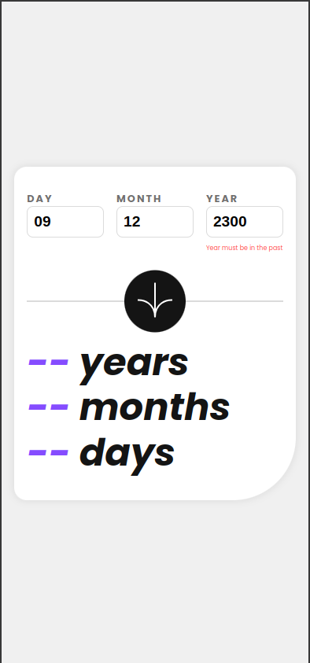

# Frontend Mentor - Age calculator app solution

This is a solution to the [Age calculator app challenge on Frontend Mentor](https://www.frontendmentor.io/challenges/age-calculator-app-dF9DFFpj-Q). Frontend Mentor challenges help you improve your coding skills by building realistic projects.

## Table of contents

- [Overview](#overview)
  - [The challenge](#the-challenge)
  - [Screenshot](#screenshot)
  - [Links](#links)
- [My process](#my-process)
  - [Built with](#built-with)
  - [What I learned](#what-i-learned)
  - [Continued development](#continued-development)
  - [Useful resources](#useful-resources)
- [Author](#author)
- [Acknowledgments](#acknowledgments)

## Overview

### The challenge

Users should be able to:

- View an age in years, months, and days after submitting a valid date through the form.
- Receive validation errors if:
  - Any field is empty when the form is submitted.
  - The day number is not between 1-31.
  - The month number is not between 1-12.
  - The year is in the future.
  - The date is invalid (e.g., 31/04/1991 as there are 30 days in April).
- View the optimal layout for the interface depending on their device's screen size.
- See hover and focus states for all interactive elements on the page.
- **Bonus**: See the age numbers animate to their final number when the form is submitted.

### Screenshot





### Links

- Solution URL: [GitHub Repository](https://github.com/yousifpa98/fm_age-calculator)
- Live Site URL: [Live GitHub Pages Site](https://yousifpa98.github.io/fm_age-calculator)

## My process

### Built with

- Semantic HTML5 markup
- CSS custom properties
- Flexbox
- JavaScript
- Mobile-first workflow

### What I learned

I learned how to handle input validation for dates and calculate the user's age based on their input. Here is an example of the age calculation logic:

```js
const calculateAge = (date) => {
  const today = new Date();
  let ageYear = today.getFullYear() - date.getFullYear();
  let ageMonth = today.getMonth() - date.getMonth();
  let ageDay = today.getDate() - date.getDate();

  if (ageDay < 0) {
    ageMonth--;
    ageDay += new Date(today.getFullYear(), today.getMonth(), 0).getDate();
  }
  if (ageMonth < 0) {
    ageYear--;
    ageMonth += 12;
  }

  return { ageYear, ageMonth, ageDay };
};
```

### Continued development

I plan to explore adding more features such as highlighting invalid inputs with better UX and providing dynamic animations for the result output.

### Useful resources

- [MDN Web Docs](https://developer.mozilla.org/) - Helped with understanding input validation and date handling.
- [Frontend Mentor Community](https://www.frontendmentor.io/community) - Great place for feedback and improving project quality.

## Author

- GitHub - [yousifpa98](https://github.com/yousifpa98)
- Frontend Mentor - [@yousifpa98](https://www.frontendmentor.io/profile/yousifpa98)

## Acknowledgments

Thanks to the Frontend Mentor community for providing guidance and inspiration throughout the project.